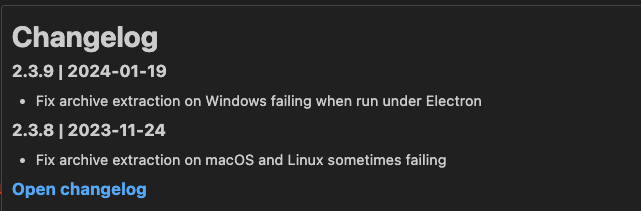
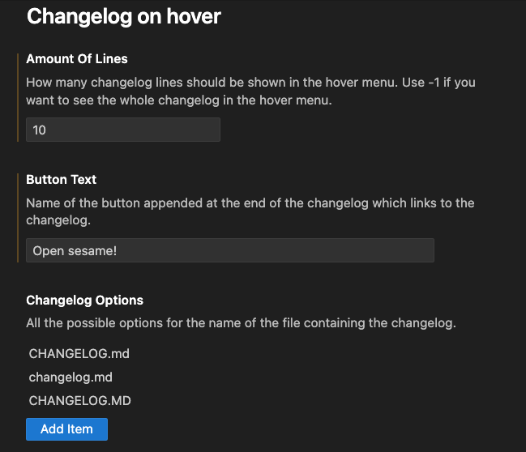

# changelog-on-hover README

## Features

It retrieves the locally provided changelog.md from node_modules. Ideal to quickly determine the latest changes for a given dependency!

## Extension Settings

This extension contributes the following settings:

-   `changelogOnHover.amountOfLines`
-   `changelogOnHover.buttonText`
-   `changelogOnHover.changelogOptions`

## Release Notes

-   TBA

### 1.0.0

Initial release of Changelog on hover.
